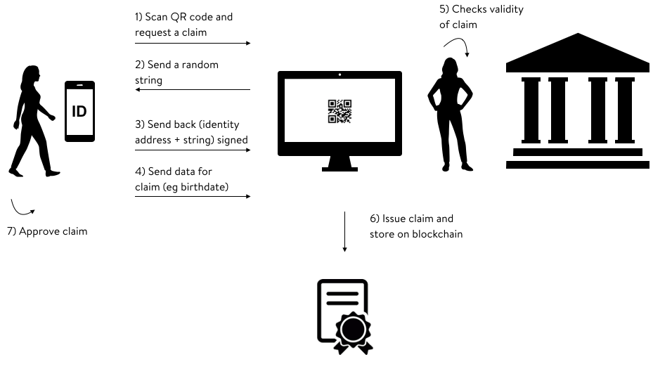

##Abstract 
The purpose of valid is to provide a public utility for self-sovereign identity with additional features for personal data management. In this paper we are going to describe our proposed approach to create a self-sovereign digital identity solution on the ethereum blockchain based on the ERC725 standard.


##Identity on the blockchain 
There are many problem that can be solved by blockchain in the context of digital identity, the biggest of all is the fragmentation and the ownership of the data. A blockchain solution could give back control of the identity and improving security and user experience. Projects like uport, civic, sovrin, have been trying to address this problem; they all adopt the same principle of “claim”. A claim is an assertion about an identity given by another identity. An identity is then ultimately a collection of claims. ERC725 The standard proposed by Fabian Vogelsteller would utilize this concept and defines and interoperable interface for it. Like in the case of ERC20 that enabled the interoperability of tokens projects.


##ERC725
An identity has a collections of public keys from either external accounts (ethereum or not), or contract addresses.
The key management functions will be the following: 
```javascript
	getKeyType
	getKeysByType
	addKey
	removeKey
	replaceKey
```

The functions to act with identity are two:
	execute
 	approve
The first to trigger functions on other contracts or itself, the second to approve an execution or a claim addition.

Lastly 2 functions to manage the claims;
	addClaim
	removeClaim
Added claims must me approved and the issuer of a claim can always revoke it. 


##ERC735 claim standard 
This standard describes standard functions for adding, removing, and holding claims.
The claim structure is the following:

```javascript
struct Claim {
    uint256 claimType;
    address issuer; // msg.sender
    uint256 signatureType; // The type of signature
    bytes signature; // this.address + claimType + data
    bytes data;
    string uri;
}
```

With the following functions:
```javascript
	getClaim
	getClaimByIDsByType
	addClaim
	removeClaim
```

##Claim privacy
To protect the identity privacy instead of saving the plain data in the claim we envision saving the hash of the data signed by the claim issuer, this would maintain the data private but enable the process of checking the integrity of the data if wanted by the identity owner. 

##USE cases 
Let’s say Alice wants her birthday to be verified by the local authority in her town, she would go to the authority office, scan a QR code to start the process. The authority sends a random string to Alice that she needs to send back with the identity address, all signed with one of her private keys. Now the authority is certain that the identity is owned by Alice. She can now send the data for her claim (her birthdate). The authority will match the date with the one on Alice’s passport and verify the trueness of the statement. If everything is correct the authority will issue a claim and publish it in the blockchain. The claim will contain the signed (by authority) hash of the data, so that the data is stored uniquely on Alice’s device but the integrity of the data can be verified. The last step needed in order to finalize the process is Alice approval to publish the claim on her identity.



Let’s say that now Alice whats to enter a casino and prove her age at the entrance. She would initiate the process by scanning a QR code. The same random string challenge will be repeated to validate the ownership of the identity. Alice also sends her birthday. After that the casino system will check the existence of the claim and its validity by comparing the hash of the birthday data claimed by alice and the one stored on the blockchain signed by the authority. The casino must know what identity are reputable issuer of claims. If the claim is verified she can now enter the casino. 


Of course this would not be a safe implementation of the protocol as Alice could borrow the identity from a friend of hers, but this impersonation can be avoided by including biometric claims about Alice. In example a photo of Alice could be saved and verified by an authority. The casino could request access to the data underlying the biometric claim and check the facial match with a face recognition algorithm and grant the access or not. 


##OUR implementation
todo

##Valid personal data use case 
todo

##Escrow contract VLD
todo

##Privacy 
considerations
zkSNARKs


	


